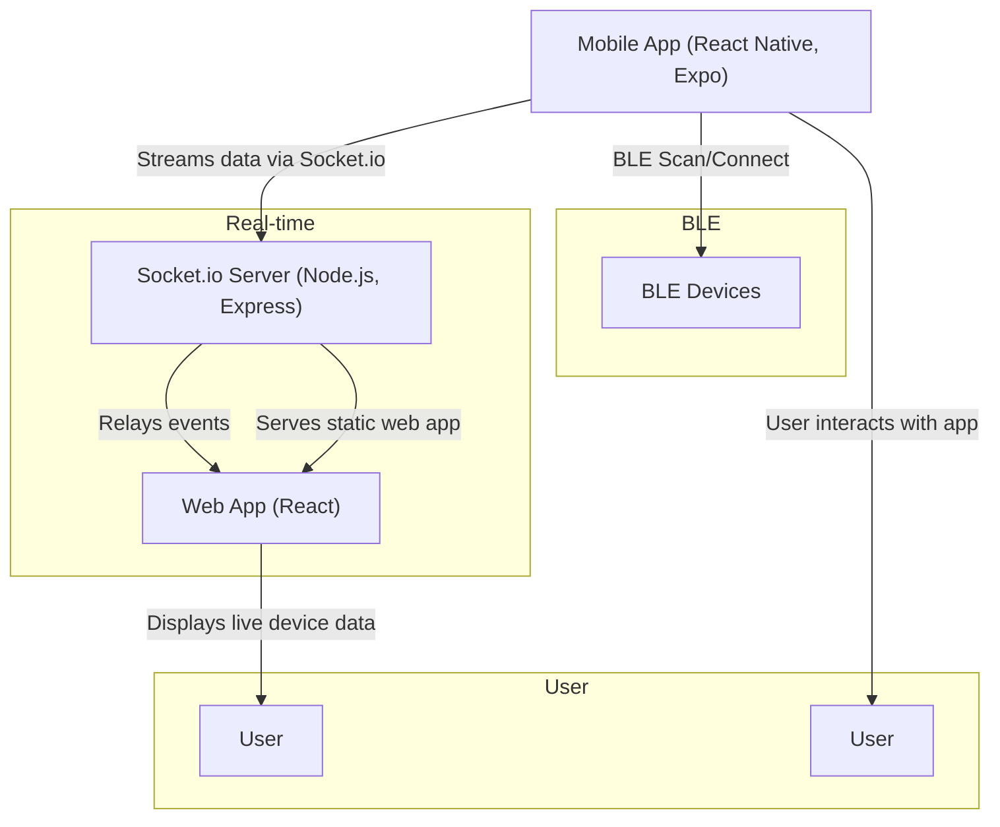

# Bluetooth & WebSocket Integration Project



## Overview

This project enables real-time monitoring of Bluetooth Low Energy (BLE) devices using a React Native mobile app, a Node.js Socket.io server, and a React web dashboard. The mobile app scans for, connects to, and streams data from real BLE devices to the server, which relays updates to the web app for live monitoring.

- **Mobile App:** Scan, connect, and stream data from multiple BLE devices. Emits events to the server via Socket.io.
- **Web App:** Displays live device status and data in real time, grouped by device.
- **Server:** Relays events between mobile and web clients, and serves the web app for unified deployment.

## Prerequisites

- Node.js (v14–20 recommended; v22+ not fully supported by Express 4.x)
- npm
- Expo CLI (`npm install -g expo-cli`)
- Physical BLE devices (for real BLE testing; see compatibility below)

## Project Structure

- `mobile/` — React Native (Expo) mobile app
- `web/` — React web app
- `server/` — Node.js + Socket.io server (also serves the web app)

## Mobile App Details

- **Technology:** React Native (Expo), using `react-native-ble-plx` for BLE and `socket.io-client` for real-time communication.
- **Purpose:**
  - Scans for nearby BLE devices and displays them in a list.
  - Allows the user to connect to multiple BLE devices and streams live data from each.
  - Emits real-time events (`device_connected`, `device_data`, `device_disconnected`) to the server.
  - Shows connection status for each device and the server.
- **Usage Notes:**
  - Must be run on a real device (not a simulator/emulator).
  - Requires Bluetooth and location permissions.
  - Designed to support at least three simultaneous BLE device connections.
  - UI provides clear feedback for scanning, connecting, disconnecting, and data streaming.
- **Deployment/Testing:**
  - Run locally with Expo Go or a custom dev client.
  - No cloud deployment is required for the mobile app itself; users install/run it on their phones.
  - Update the Socket.io server URL in the code to point to your deployed server (e.g., on Render).
- **Configuration:**
  - The Socket.io server URL is set in the code (e.g., `SOCKET_SERVER_URL` in `mobile/app/index.tsx`).
    Update this to match your deployed server.

## BLE Device Compatibility

- BLE is designed for low-power, low-bandwidth data (e.g., fitness trackers, sensors, beacons, custom BLE peripherals).
- For best results, use BLE peripherals such as fitness trackers, BLE thermometers, or a BLE simulator app.
- Not all Bluetooth devices support BLE or expose notifiable/readable characteristics. Ensure your device is advertising and supports BLE.

## Server Details

- **Technology:** Node.js, Express, and Socket.io.
- **Purpose:**
  - Relays real-time events between mobile and web clients using Socket.io (WebSocket).
  - Serves the built web app for unified deployment (static files from `web/build`).
  - Handles multiple clients in a shared Socket.io room for group monitoring.
- **Deployment Notes:**
  - Requires a platform that supports persistent WebSocket connections (e.g., Render.com, Railway, Fly.io, Heroku, or a VPS).
  - Not suitable for serverless platforms like Vercel or Netlify for the server component.
  - Listens on the port specified by `process.env.PORT` (default: 3000).
  - Logs all device connection, data, and disconnection events for debugging.

## Web App Details

- **Technology:** React (Create React App).
- **Purpose:**
  - Connects to the Socket.io server to receive real-time device events.
  - Displays a live dashboard of all connected BLE devices, their status, and latest data.
  - Groups events by device and highlights new connections and data updates.
- **Deployment Notes:**
  - Can be deployed to any static hosting provider (e.g., Vercel, Netlify, GitHub Pages).
  - When served from the server, the web app is accessible at the same URL as the server (e.g., `https://your-server.onrender.com`).
  - The web app must be configured to connect to the correct Socket.io server URL (update the connection URL in the code as needed).

## Setup Instructions

### 1. Clone the Repository

```sh
git clone <your-repo-url>
cd <repo-folder>
```

### 2. Install Dependencies

#### Mobile App

```sh
cd mobile
npm install
```

#### Web App

```sh
cd ../web
npm install
npm run build  # Build the web app for production
```

#### Server

```sh
cd ../server
npm install
```

### 3. Running the Apps

#### Start the Socket.io Server (also serves the web app)

```sh
cd server
node index.js
```

- Server runs on `https://ble-f760.onrender.com/` by default.
- The web app is now accessible at the same URL: `https://ble-f760.onrender.com/`.
- All Socket.io and API traffic is handled by the same server, avoiding CORS issues.

#### Start the Mobile App

```sh
cd ../mobile
expo start -c  # Clear cache for reliability
```

- Use a real device for BLE scanning (BLE does not work in emulators/simulators).
- Scan the QR code with Expo Go or run on a connected device.
- Grant Bluetooth and location permissions when prompted.
- The app will scan for nearby BLE devices, allow you to connect, and stream data to the server.

## Usage

- The mobile app scans for nearby BLE devices, allows manual connection, and streams data to the server.
- The web app displays live device status and data in real time.
- All communication is via a shared Socket.io room.
- The system is designed to support at least three simultaneous BLE device connections.

## Troubleshooting

- **Node.js v22+ is not fully supported by Express 4.x.** If you see errors related to `path-to-regexp`, downgrade to Node.js v20 or v18, or use Express 4.x as in this project. See [Express issue #6038](https://github.com/expressjs/express/issues/6038).
- Ensure all apps point to the correct Socket.io server URL.
- If running on a physical device, your device and computer must be on the same network.
- For CORS or network issues, check firewall and server logs.
- If the mobile app shows the default Expo screen, ensure `App.js` is set up to use your custom components and try `expo start -c`.
- BLE scanning may not show all devices; ensure your BLE device is advertising and supports BLE (not just Classic Bluetooth).
- If you see permission errors, check that you have granted all required Bluetooth and location permissions.

## License

MIT
